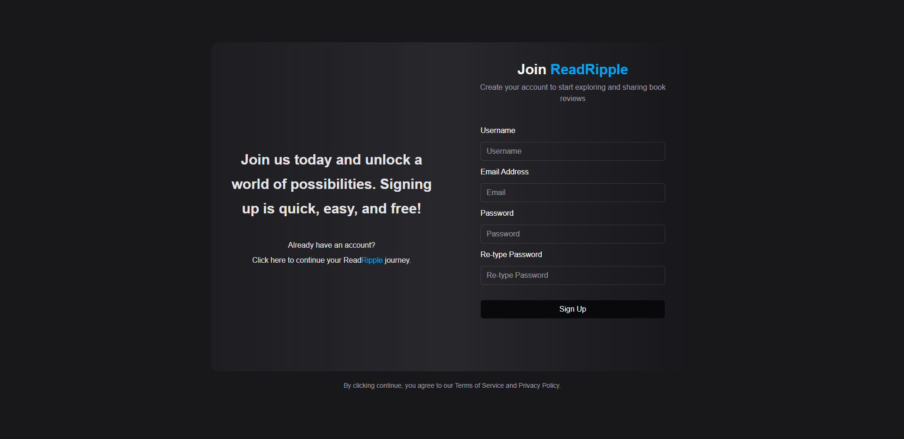
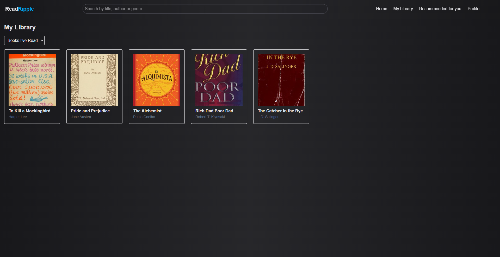
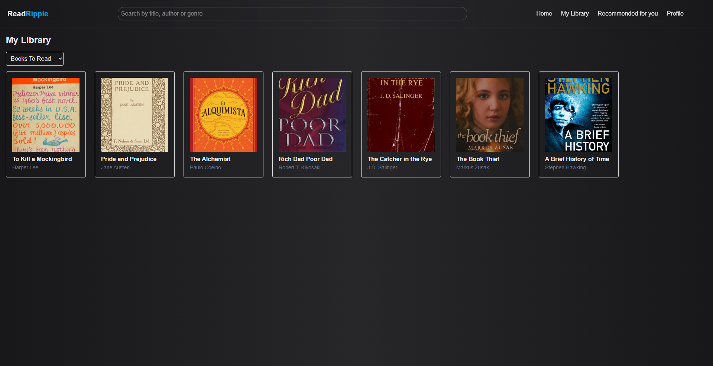

# 📚 ReadRipple – Book Discovery & Review Platform

**ReadRipple** is a full-stack MERN application that lets book lovers explore, review, and track books. Users can browse a curated collection, write reviews, and maintain their own reading list, while admins manage the book database.

---

## 🚀 Features

- 🔍 **Search** books by title, author, or genre
- 🧾 **Read and write reviews**
- ⭐ **Live average ratings** updated with every review
- 📚 **My Library**: track books you’ve read or plan to read
- 👤 **Role-based Authentication**
  - Users can register, log in, and post/edit/delete their own reviews
  - Admins can add/delete books
- 🏷️ **Tags & genres**
- 🖼️ **Real cover images** with online sources

---

## 🛠️ Tech Stack

| Frontend | Backend | Database |
|----------|---------|----------|
| React + Tailwind CSS | Express.js + Node.js | MongoDB + Mongoose |

- **Routing**: React Router
- **Security**: Backend-protected routes and admin-only access control

---

## 🔐 Admin Access

- Admins can:
  - Access the **Add New Book** page
  - Manage the database
- Admin status is stored in MongoDB and protected with secure middleware

---

## 🧪 Getting Started

### Prerequisites

- Node.js
- MongoDB (local or Atlas)
- npm

### Clone & Install

```bash
git clone https://github.com/sidharthpandithar/readripple.git
cd readripple
```

### Backend Setup

```bash
cd backend
npm install
npm start
```

### Frontend Setup

```bash
cd frontend
npm install
npm run dev
```

---

## 📸 Screenshots / Demo

- Login Page
  


- Sign Up Page
  


- Home Page
  


- View Book Details & Reviews
  


- Search Book Results
  


- My Library - Books I've Read
  


- My Library - Books to Read
  


- My Library - My Reviews
  


- Add Book Dashboard (Admin Only)
  


---

## ✨ Upcoming Features

- ✅ Personalized book recommendations
- ✅ Review likes & comment threads
- ✅ User profile & activity history
- ✅ Admin dashboard with analytics

---

## 💡 Inspiration

Built by a book lover for book lovers, **ReadRipple** aims to bring thoughtful reviews and personal reading lists into a clean, easy-to-use platform for readers of all genres.

---

## 🤝 Contributing

Contributions, issues and feature requests are welcome!  
Feel free to open a pull request or issue.

---

## 📄 License

This project is [MIT](LICENSE) licensed.

---

## 👋 Author

Made with ❤️ by [Sidharth Pandithar](https://github.com/sidharthpandithar)

